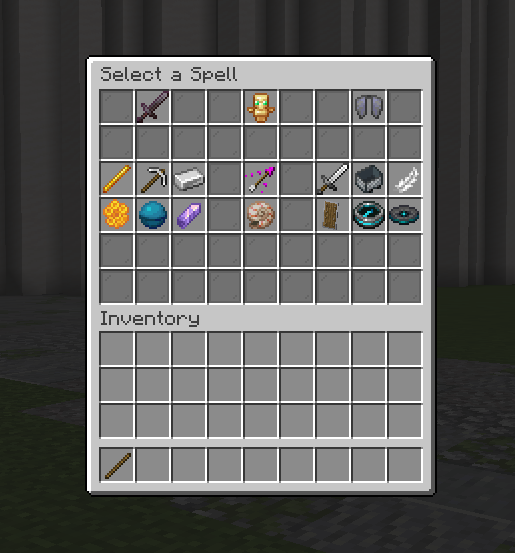
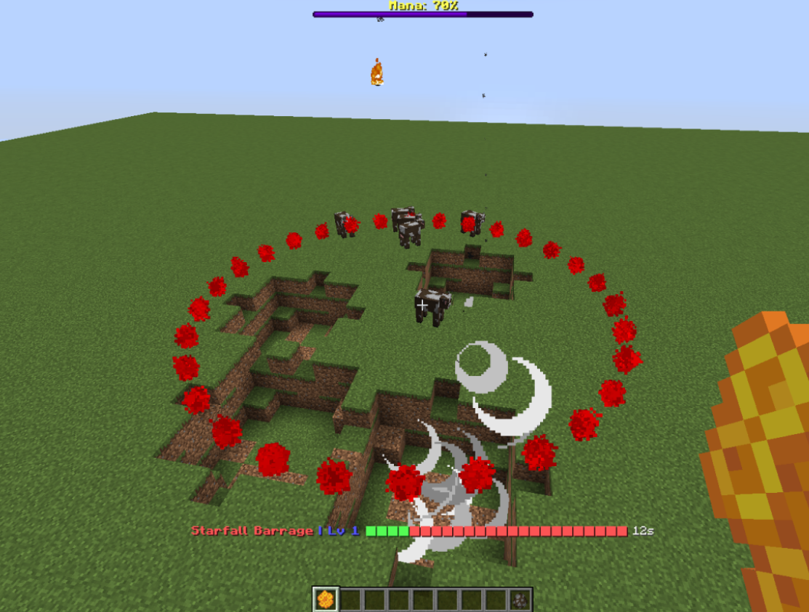

# Wizards Plugin
Tested on Minecraft 1.20.4 & 1.21.1 Spigot

Right-click a Stick to open the spell menu.

## List of Spells
* Fiery Wand
* Teleport
* Mjolnir
* Gust
* The Great Escape
* Big Man Slam
* Winged Shield
* Voidwalker
* Starfall Barrage
* Heal Cloud
* Void Orb
* Recall
* Dragon Spit
* Cod Shooter

## Minigame
* /Wizards start | stop | join | leave
* /Setspawn to set spawns for minigame
* /Map1 /Map2 /Mapsave to save map boundaries
* /Mapregen to regenerate all blocks saved in /Mapsave
* /Fillchests to fill all chests within the map bounds

## Teams
* /Wizteams create | delete | join | leave | add | remove

## Admin commands
* /Unlockspells (Level up all of your spells by 1 level)
* /Mana (Toggles unlimited mana)
* /Cooldowns (Toggles cooldowns on and off)

## Screenshots
Spell Menu:

Example UI:

